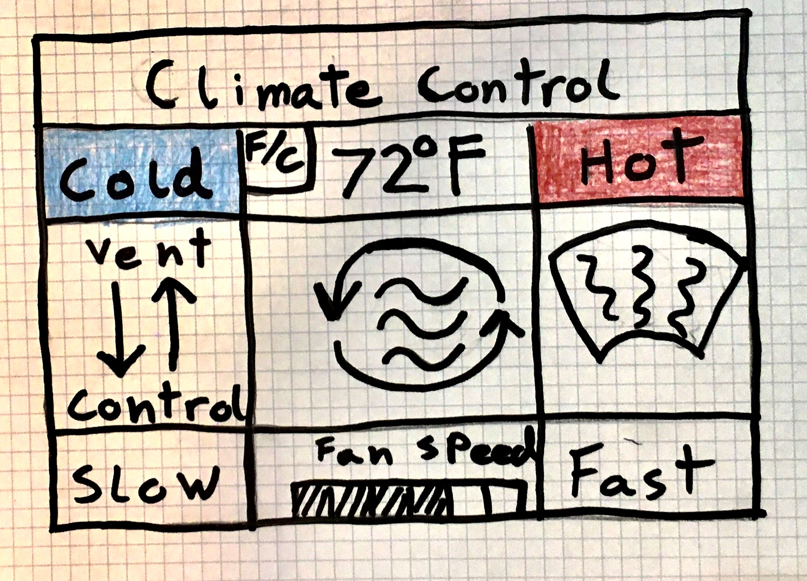

The linked image is a concept drawing of a vehicle climate control UI.

All of the controls are accessed by tapping or pressing and holding the UI buttons.

In the center of the UI is the button used to control whether air is recycled through the vehicle. This control can be toggled on or off simply by tapping the button on the UI. The controls for the fan speed are located at the bottom of the UI screen. The button to lower fan speed is in the bottom left corner, and the button to raise it is in the bottom right corner. In the bottom center of the screen is a display bar that shows where the fan speed is currently set. Fan speed can be increase one unit by tapping the "fast" button, or increased quickly by pressing and holding the fast button. Fan speed is decreased in the same manner using the "slow" button. The button to toggle windsheild defogging on or off is in the center right of the UI, and the button to toggle the vents up or down is in the center left. Temperature change works similarly to fan speed change. Temperature controls are located at the top of the UI. Temperature can be changed by tapping/pressing and holding the "cold" or "hot" buttons. A digital display in the top center shows the current temperature. The temperature display can be toggled between Celsius and Fahrenheit with a small button on the upper left of the temperature display.

Customers for the UI would include anyone in the market for a new vehicle. This could include people in non-english speaking countries, so the UI will be programmed in a way that allows the dealer to set the language of the UI prior to sale. The available temperature scales, celsius and fahrenheit, should make the temperature controls accessable to most markets (though perhaps we could include Kelvin and market the car specifically to physicists).